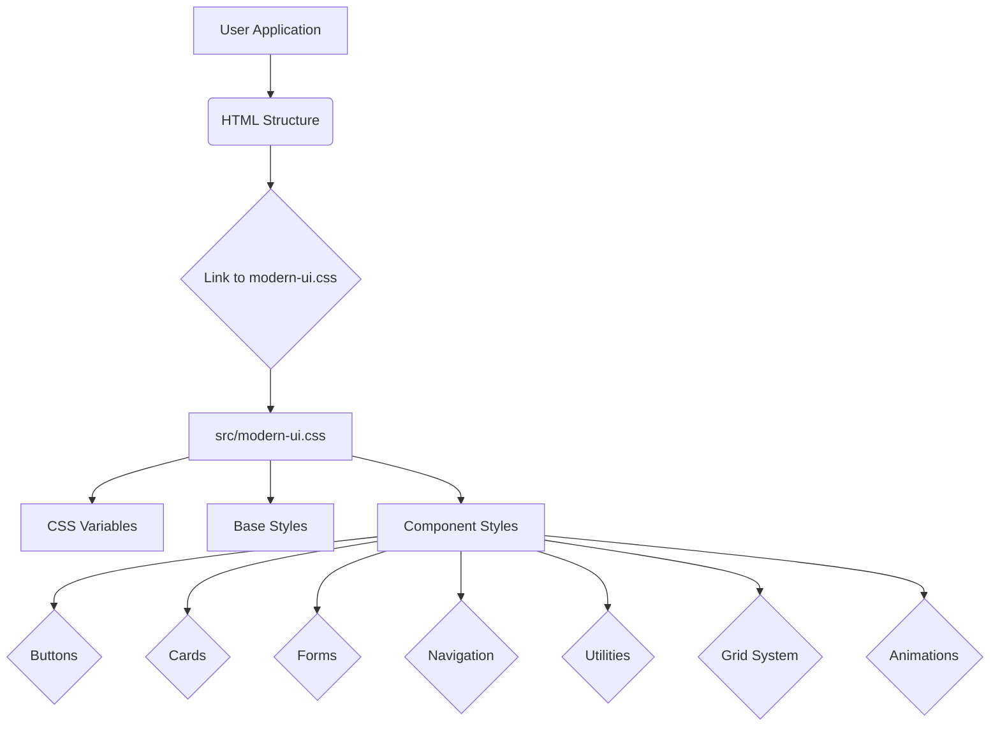
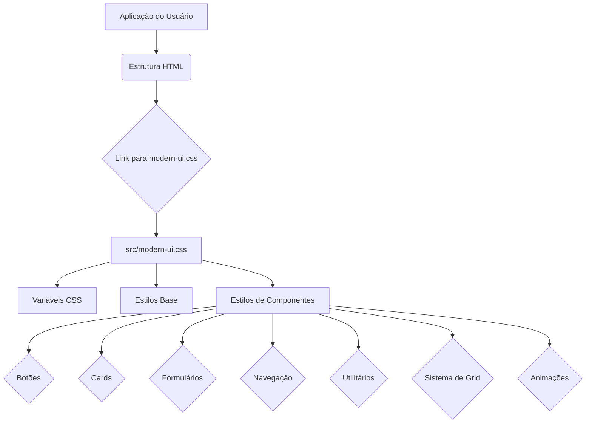

# 🎨 CSS Modern UI Components

<div align="center">


**Professional CSS Component Library for Modern Web Applications**

[🇺🇸 English](#english) | [🇧🇷 Português](#português)

</div>

---

## 🇺🇸 English

### 📋 Overview

A comprehensive CSS component library featuring modern, responsive, and accessible UI components. Built with pure CSS3, this library provides everything needed for professional web applications. It's designed to be lightweight, highly customizable, and easy to integrate into any web project.

### ✨ Features

- **🎨 Modern Design** - Contemporary UI components with beautiful aesthetics and clean typography.
- **📱 Responsive** - Mobile-first design approach ensuring optimal display across all devices.
- **♿ Accessible** - WCAG compliant components, promoting inclusivity for all users.
- **⚡ Lightweight** - Pure CSS with no external dependencies, ensuring fast loading times.
- **🎯 Professional** - Enterprise-ready components suitable for high-quality portfolio projects.
- **🔧 Customizable** - Easy theming with CSS variables for quick adaptation to any brand.
- **🚀 GitHub Pages Demo** - Live interactive demonstration available via GitHub Pages.

### 🚀 Quick Start

To get started with this library, follow these simple steps:

1. **Clone the repository:**
   ```bash
   git clone https://github.com/GabrielDemetriosLafis/CSS-Modern-UI-Components.git
   cd CSS-Modern-UI-Components
   ```

2. **Include the stylesheet in your project:**
   Add the following line to the `<head>` section of your HTML file:
   ```html
   <link rel="stylesheet" href="path/to/your/project/src/modern-ui.css">
   ```
   *(Adjust the path according to your project structure)*

3. **Start using components:**
   You can now use the defined CSS classes in your HTML. For example, to create a primary button:
   ```html
   <button class="btn btn-primary">Click me</button>
   ```

### 💡 Usage Examples

#### Buttons
```html
<button class="btn btn-primary">Primary Button</button>
<button class="btn btn-secondary">Secondary Button</button>
<button class="btn btn-outline">Outline Button</button>
```

#### Cards
```html
<div class="card">
    <div class="card-header">Card Title</div>
    <div class="card-body">
        <p>This is the body of the card with some content.</p>
    </div>
    <div class="card-footer">Card Footer</div>
</div>
```

#### Forms
```html
<form>
    <div class="form-group">
        <label for="exampleInput" class="form-label">Input Label</label>
        <input type="text" id="exampleInput" class="form-input" placeholder="Enter text">
    </div>
    <button type="submit" class="btn btn-primary">Submit</button>
</form>
```

### 🏗️ Architecture Diagram



### 📄 License

This project is licensed under the MIT License - see the [LICENSE](LICENSE) file for details.

### 👨‍💻 Author

**Gabriel Demetrios Lafis**
- 🌐 GitHub: [@GabrielDemetriosLafis](https://github.com/GabrielDemetriosLafis)

---

## 🇧🇷 Português

### 📋 Visão Geral

Uma biblioteca abrangente de componentes CSS que apresenta componentes de UI modernos, responsivos e acessíveis. Construída com CSS3 puro, esta biblioteca fornece tudo o que é necessário para aplicações web profissionais. Ela foi projetada para ser leve, altamente personalizável e fácil de integrar em qualquer projeto web.

### ✨ Funcionalidades

- **🎨 Design Moderno** - Componentes de UI contemporâneos com estética bonita e tipografia limpa.
- **📱 Responsivo** - Abordagem de design mobile-first garantindo exibição ideal em todos os dispositivos.
- **♿ Acessível** - Componentes compatíveis com WCAG, promovendo a inclusão para todos os usuários.
- **⚡ Leve** - CSS puro sem dependências externas, garantindo tempos de carregamento rápidos.
- **🎯 Profissional** - Componentes prontos para empresas, adequados para projetos de portfólio de alta qualidade.
- **🔧 Customizável** - Fácil tematização com variáveis CSS para rápida adaptação a qualquer marca.
- **🚀 Demonstração no GitHub Pages** - Demonstração interativa ao vivo disponível via GitHub Pages.

### 🚀 Início Rápido

Para começar a usar esta biblioteca, siga estes passos simples:

1. **Clone o repositório:**
   ```bash
   git clone https://github.com/GabrielDemetriosLafis/CSS-Modern-UI-Components.git
   cd CSS-Modern-UI-Components
   ```

2. **Inclua a folha de estilo em seu projeto:**
   Adicione a seguinte linha à seção `<head>` do seu arquivo HTML:
   ```html
   <link rel="stylesheet" href="path/to/your/project/src/modern-ui.css">
   ```
   *(Ajuste o caminho de acordo com a estrutura do seu projeto)*

3. **Comece a usar os componentes:**
   Agora você pode usar as classes CSS definidas em seu HTML. Por exemplo, para criar um botão primário:
   ```html
   <button class="btn btn-primary">Clique aqui</button>
   ```

### 💡 Exemplos de Uso

#### Botões
```html
<button class="btn btn-primary">Botão Primário</button>
<button class="btn btn-secondary">Botão Secundário</button>
<button class="btn btn-outline">Botão Contorno</button>
```

#### Cards
```html
<div class="card">
    <div class="card-header">Título do Card</div>
    <div class="card-body">
        <p>Este é o corpo do card com algum conteúdo.</p>
    </div>
    <div class="card-footer">Rodapé do Card</div>
</div>
```

#### Formulários
```html
<form>
    <div class="form-group">
        <label for="exampleInput" class="form-label">Rótulo do Campo</label>
        <input type="text" id="exampleInput" class="form-input" placeholder="Digite o texto">
    </div>
    <button type="submit" class="btn btn-primary">Enviar</button>
</form>
```

### 🏗️ Diagrama de Arquitetura



### 📄 Licença

Este projeto está licenciado sob a Licença MIT - veja o arquivo [LICENSE](LICENSE) para detalhes.

### 👨‍💻 Autor

**Gabriel Demetrios Lafis**
- 🌐 GitHub: [@GabrielDemetriosLafis](https://github.com/GabrielDemetriosLafis)

